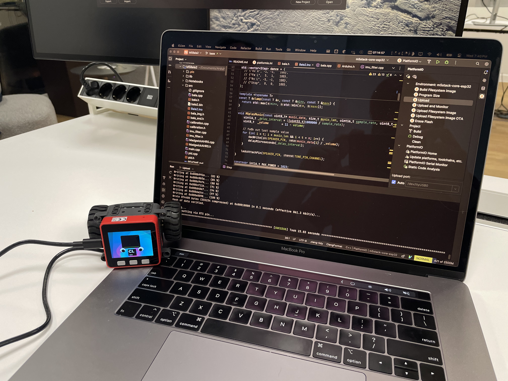
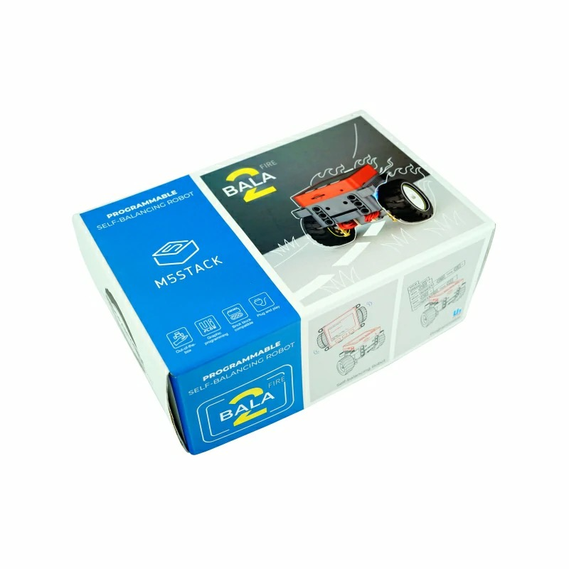
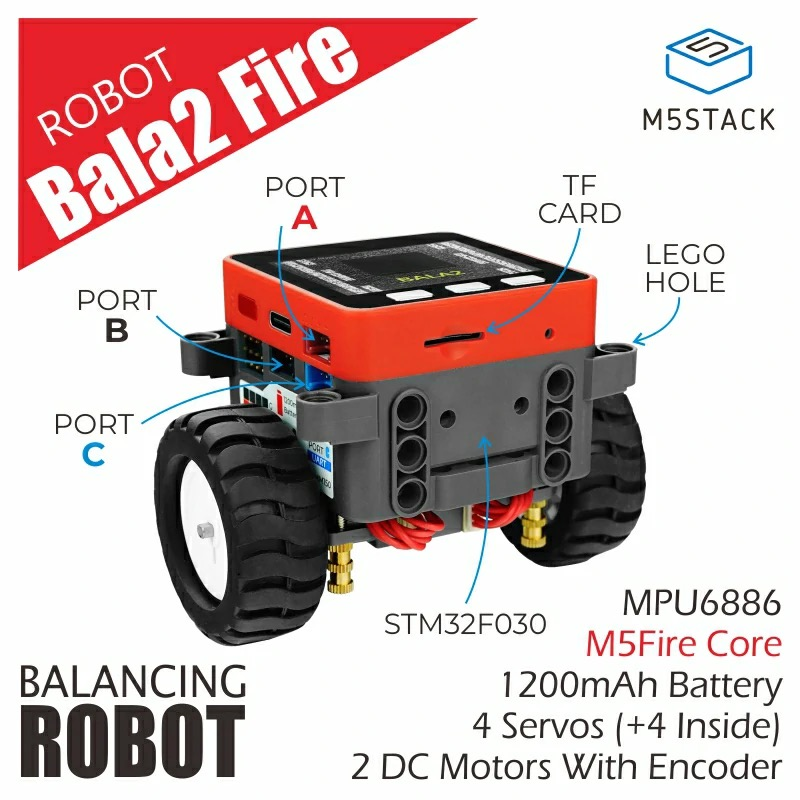

# M5Bala for CLion
M5Stack balance car: CLion project with installed PaltformIO plugin

## Hardware

* M5 Bala Fire (Bala 2)
  * [Web Archive: BALA2Fire](https://web.archive.org/web/20240512191808/https://docs.m5stack.com/en/app/bala2fire)

<table>
<tr>

<td>

</td>

<td>

</td>

</tr>
</table>

### Quick Start

- Install [CLion](https://www.jetbrains.com/clion/download/)
- Install [PaltformIO](https://docs.platformio.org/en/latest/core/installation/methods/index.html)
- Install [PaltformIO plugin in CLion](https://www.jetbrains.com/help/clion/platformio.html#create-prj)
- Install USB driver for burner for
  - [Mac](https://learn.adafruit.com/how-to-install-drivers-for-wch-usb-to-serial-chips-ch9102f-ch9102/mac-driver-installation)
  - [Windows](https://learn.adafruit.com/how-to-install-drivers-for-wch-usb-to-serial-chips-ch9102f-ch9102/windows-driver-installation) 
- Using CLion checkout the project from https://github.com/alexey-utkin/M5Bala-for-CLion.git
- Open the file platformio.ini as a project
- Enjoy!
